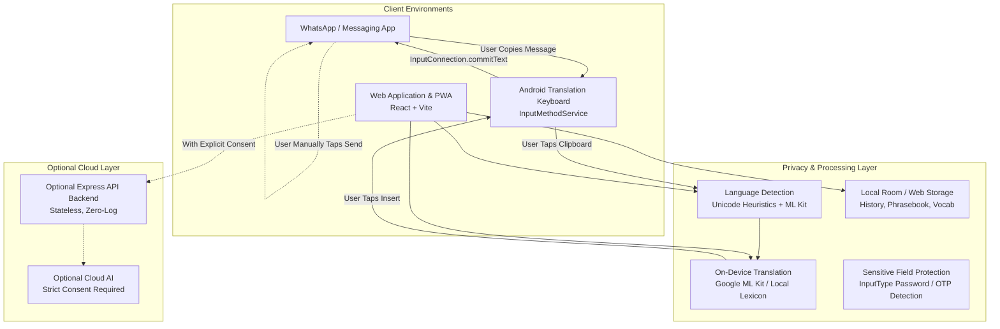

# Hindi Assist — System Architecture

## 1. Overview
**Hindi Assist** is a privacy-first multilingual communication assistance, on-device translation, and language-learning platform covering English, Hindi, and Telugu.

## 2. Architectural Pillars

### 2.1 Separation of Concerns
1. **Android Keyboard (`android/`)**: Pure Kotlin Android Input Method Service interacting via official `InputMethodService` and `InputConnection` APIs. Independent from web logic.
2. **Web Frontend (`web/frontend/`)**: Modern React + Vite application with PWA installation, comprehensive design token theming, and an interactive keyboard simulator.
3. **Backend Service (`backend/`)**: Stateless Node.js Express service providing fallback synthesis and extensibility without retaining user messages.
4. **Structured Language Resources (`language-data/`)**: Central JSON schemas for vocabulary, phrases, patterns, mistakes, and dialogues.

### 2.2 Privacy-By-Design Guarantee
- **On-Device Default**: Translation priority is local execution via Google ML Kit on Android and local synthesis in browser.
- **Zero-Log Enforcement**: Requests strictly scrub user payload from logs.
- **Explicit-Only Clipboard Access**: Clipboard is accessed solely upon direct user action.
- **Zero WhatsApp Scraping**: No accessibility service snooping, no database introspection, no network sniffing.
